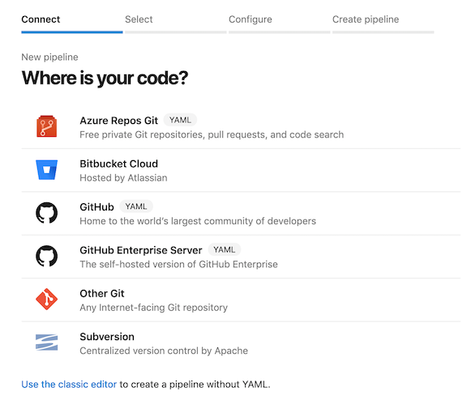
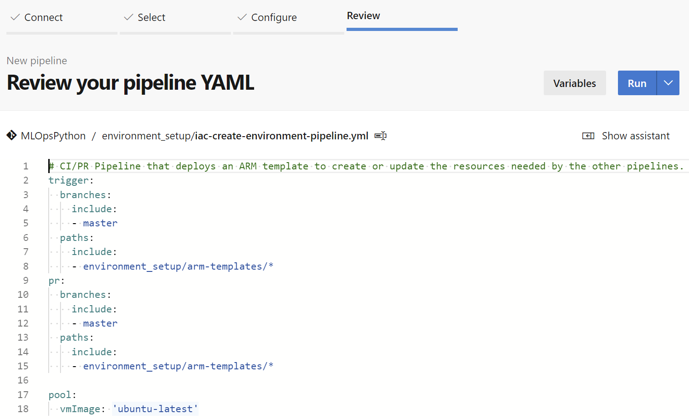
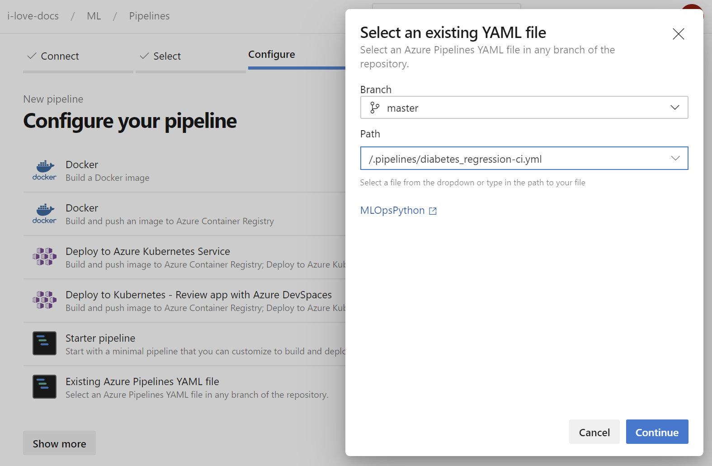
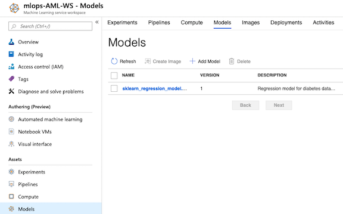
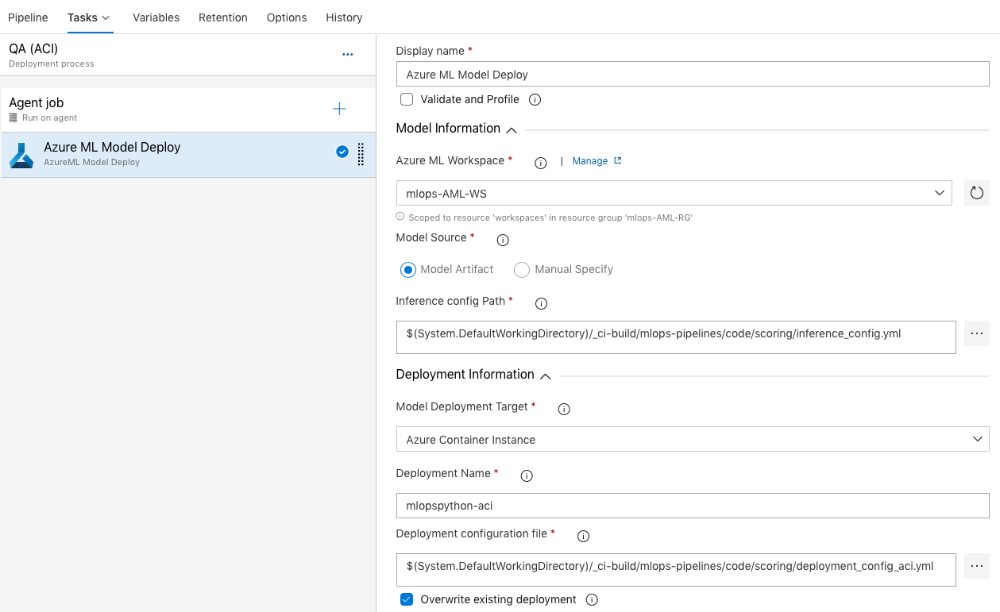
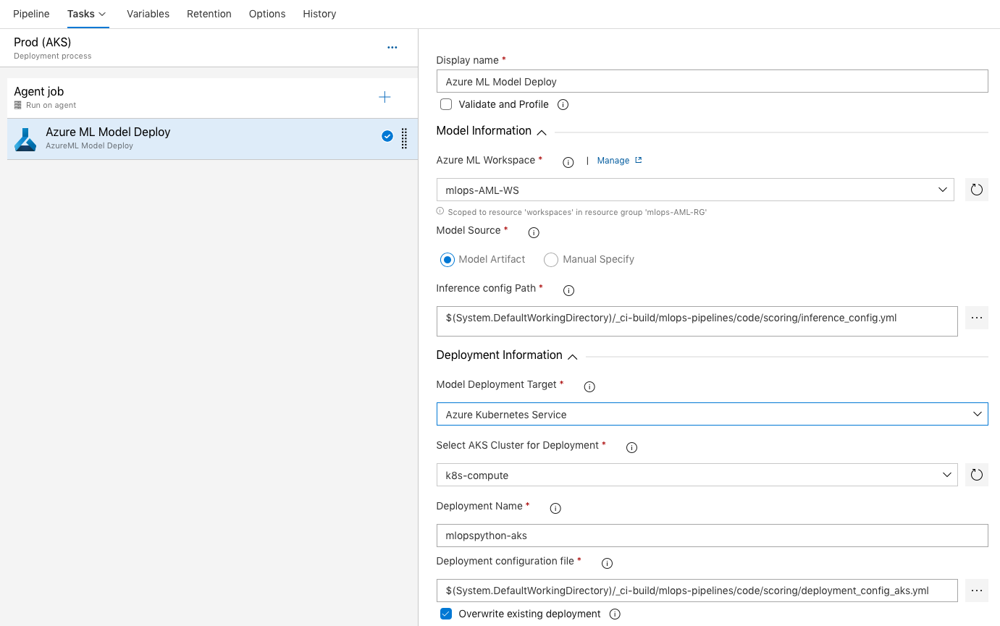

## Getting Started with this Repo

### 1. Get the source code
- Either clone the repository to your workspace and create your own repo with the code in GitHub.
- An easier way is to just fork the project, so you have the repository under your username on GitHub itself.


### 2. Create Azure DevOps account
We use Azure DevOps for running our build(CI), retraining trigger and release (CD) pipelines. If you don't already have Azure DevOps account, create one by following the instructions [here](https://docs.microsoft.com/en-us/azure/devops/organizations/accounts/create-organization?view=azure-devops)

If you already have Azure DevOps account, create a [new project](https://docs.microsoft.com/en-us/azure/devops/organizations/projects/create-project?view=azure-devops).


### 3. Create Service Principal to Login to Azure

To create service principal, register an application entity in Azure Active Directory (Azure AD) and grant it the Contributor or Owner role of the subscription or the resource group where the web service belongs to. See [how to create service principal](https://docs.microsoft.com/en-us/azure/active-directory/develop/howto-create-service-principal-portal) and assign permissions to manage Azure resource.
Please make note of the following values after creating a service principal, we will need them in subsequent steps
- Application (client) ID
- Directory (tenant) ID
- Application Secret


**Note:** You must have sufficient permissions to register an application with your Azure AD tenant, and assign the application to a role in your Azure subscription. Contact your subscription adminstator if you don't have the permissions. Normally a subscription admin can create a Service principal and can provide you the details.


### 4. Create a Variable Group

We make use of variable group inside Azure DevOps to store variables and their values that we want to make available across multiple pipelines. You can either store the values directly in [Azure DevOps](https://docs.microsoft.com/en-us/azure/devops/pipelines/library/variable-groups?view=azure-devops&tabs=designer#create-a-variable-group) or connect to an Azure Key Vault in your subscription. Please refer to the documentation [here](https://docs.microsoft.com/en-us/azure/devops/pipelines/library/variable-groups?view=azure-devops&tabs=designer#create-a-variable-group) to learn more about how to create a variable group and [link](https://docs.microsoft.com/en-us/azure/devops/pipelines/library/variable-groups?view=azure-devops&tabs=designer#use-a-variable-group) it to your pipeline.
 
Please name your variable group **``devopsforai-aml-vg``** as we are using this name within our build yaml file. 

The varibale group should contain the following variables:

a table (name, description, value)

Mark **SP_APP_SECRET** variable as a secret one.

Make sure to select the **Allow access to all pipelines** checkbox in the variable group configuration.

Up until now you should have 
- Forked (or cloned) the repo
- Created a devops account or use an existing one
- Got service principal details and subscription id
- A variable group with all configuration values

### 5. Create resources 

The easiest way to create all required resources (Resource Group, ML Workspace, Container Registry, Storage Account, etc.) is to leverage an "Infrastructure as Code" [pipeline coming in this repository](../environment_setup/iac-create-environment.yml). This **IaC** pipeline takes care of all required resources basing on these [ARM templates](../environment_setup/arm-templates/cloud-environment.json). The pipeline requires an **Azure Resource Manager** service connection


Give the connection name **``AzureResourceConnection``** as it is referred by the pipeline definition.

In your DevOps project create a build pipeline from your forked **GitHub** repository 



Refer to an **Existing Azure Pipelines YAML file** 


Having done that, run the pipeline


Check out created resources in the [Azure Portal](portal.azure.com)


Alternatively, you can also use a [cleaning pipeline](../environment_setup/iac-create-environment.yml) that removes resources ctreated for this project or you can just delete a resource group in the [Azure Portal](portal.azure.com).


### 6. Set up Build Pipeline

In your [Azure DevOps](https://dev.azure.com) project create and run a new build pipeline refereing to  **azdo-ci-build-train.yml** pipeline in yuor forked **GitHub** repository



Once the pipline is finished, explore the execution logs 


and checkout a published training pipeline in the **mlops-AML-WS** workspace in [Azure Portal](https://ms.portal.azure.com/)


Rename the pipeline as **ci-build**.

Great, you now have the build pipeline setup, you can either manually trigger it or it gets automatically triggered everytime there is a change in the master branch. The pipeline performs linitnig, unit testing, builds and publishes an **ML Training Pipeline** in an **ML Workspace**

### 6. Train the Model

The next step is to invoke the training pipeline created in the previous step. It can be done with a **Release Pipeline**:


An artifact of this pipeline will be the result of the build pipeline **ci-buid**


Configure a pipeline to see values from the previously defined variable group **devopsforai-aml-vg**


Add an empty stage with name **``Invoke Training Pipeline``** and make sure that the **Agent Specification** is **``ubuntu-16.04``**


Add a command line step **``Invoke Training Pipeline``** with the following script

```bash
docker run  -v $(System.DefaultWorkingDirectory)/_ci-build/mlops-pipelines/ml_service/pipelines:/pipelines -w=/pipelines -e MODEL_NAME=$MODEL_NAME -e EXPERIMENT_NAME=$EXPERIMENT_NAME microsoft/mlopspython python run_train_pipeline.py
```

The pipeline is triggered whenever a new training pipeline is published by the builder pipeline. It can also be triggered manually or configured to run on a scheduled basis. Create a new release to trigger the pipeline manually


Once the pipeline is completed, check out in the **ML Workspace** that the training pipeline is running 


The training pipeline will train, evaluate and register a new model. Wait intil it is fininshed and make sure there is a new model in the **ML Workspace**



Good! Now we have a trained model.

### 6. Train the Model

The final step is to deploy the model across environments with a release pipeline. There will be a **``QA``** environment running on [Azure Container Instances](https://azure.microsoft.com/en-us/services/container-instances/) and a **``Prod``** environment running on [Azure Kubernetes Service](https://azure.microsoft.com/en-us/services/kubernetes-service). 


This pipeline leverages the **Azure Machine Learning** extension that should be installed in your organization from the [marketplace](https://marketplace.visualstudio.com/items?itemName=ms-air-aiagility.vss-services-azureml)

The pipeline consumes two artifacts: the result of the **Build Pipeline** as it contains configuration files and the **model** trained and registered by the ML training pipeline. 

Configuration of a code **``_ci-build``** artifact is similar to what we did in the previous chapter. 

In order to configure a model artifact there should be a service connection to **``mlops-AML-WS``** workspace.


Add an artifact to the pipeline and select **AzureML Model Artifact** source type. Select the **Service Endpoint** and **Model Names** from the drop down lists


Create a stage **``QA (ACI)``** and add a single task to the job **Azure ML Model Deploy**. Specify task parameters as it is shown below



In a similar way create a stage **``Prod (AKS)``** and add a single task to the job **Azure ML Model Deploy**. Specify task parameters as it is shown below




Note! Creating of a Kubernetes cluster on AKS is out of scope of this tutorial, so you should take care of it on your own.

Save the pipeline and craete a release for it to trigger the pipeline manually. Once it's finished, check out deployments in the **``mlops-AML-WS``** workspace.


Congratulations, you now have three pipelines set up end to end.
   - Build pipeline: triggered on code change to master branch on GitHub, performs linting, unit testing and publishing a trainig pipeline
   - Release Trigger pipeline: runs a published training pipeline to trian, evaluate and register a model
   - Release Deployment pipeline: deploys a model to QA (ACI) and Prod (AKS) environemts
    
